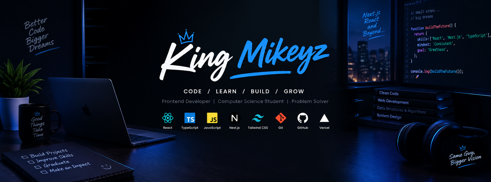

 

<h1>Hi there 👋, I'm King Michael</h1>

  <strong>Frontend Developer • Computer Science Student • Builder</strong>

  
  

---

## 👨🏽‍💻 About Me

I'm King Michael, a Computer Science student and frontend developer from Nigeria.

I enjoy turning ideas into functional web applications and continuously improving my skills by building real projects.

I'm currently focused on writing better JavaScript and TypeScript, building modern interfaces with React and Next.js, and learning more about backend development and databases.

* 💻 Frontend Developer
* 🎓 Computer Science Student
* 🇳🇬 Based in Nigeria
* 🚀 Building and experimenting with web applications
* 🌱 Currently improving my React, TypeScript, and Next.js skills
* 🗄️ Exploring backend development with Supabase and PostgreSQL
* 🧠 Learning through real-world projects
* ♟️ Chess enthusiast

---

## 🛠️ Tech Stack

### Frontend

  
  
  
  
  
  
  

### Backend & Database

  
  

### Tools

  
  
  
  
  

---

## 🚀 Featured Projects

### 🔐 PassMate

A password management application built with a focus on organizing and managing user credentials.

Built with React and Supabase.

<a href="https://github.com/King-Mikeyz/passmate">
  View Repository →
</a>

---

### 🤖 AI Learning Platform

An AI-powered learning platform designed to make studying more interactive and personalized.

Currently being developed and improved as I explore AI-powered applications.

---

### 💼 Developer Portfolio

My personal portfolio website where I showcase my projects, skills, and experience as a developer.

<a href="https://michael-ezenwugo-portfolio.vercel.app/">
  View Live Website →
</a>

<a href="https://github.com/King-Mikeyz/michael-ezenwugo-portfolio">
  View Repository →
</a>

---

### 🛍️ King Michael Collections

A digital products platform focused on software, developer resources, and useful code snippets.

Currently in development.

---

## 🌱 Currently Learning

  

I'm focused on strengthening my fundamentals while building applications that solve real problems.

---

## 🎯 What I'm Working Toward

* Building better and more maintainable frontend applications
* Becoming stronger with JavaScript and TypeScript
* Improving my React and Next.js skills
* Understanding backend architecture
* Building and deploying production-ready applications
* Contributing to open-source projects
* Growing as a Computer Science student and developer

---

## 📊 GitHub Stats

  

  

---

## 🏆 GitHub Trophies

---

## 📈 Contribution Graph

---

## 🤝 Connect With Me

 

<i>Code. Learn. Build. Grow.</i>

